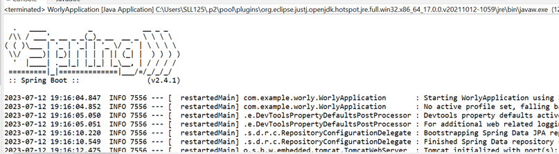
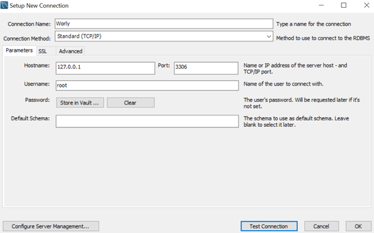
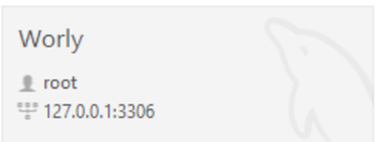
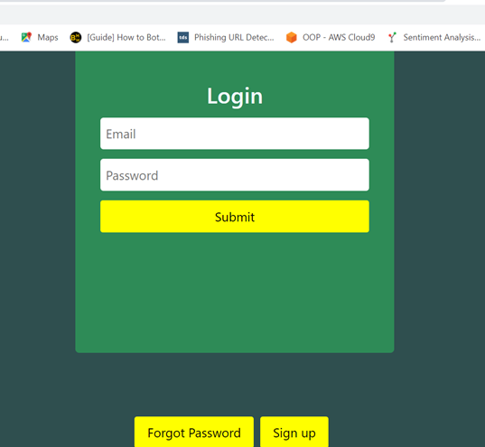

# Worly Configurations

## Tools Required to RUN Worly
1. Any JAVA IDE, such as: [Eclipse](https://www.eclipse.org/downloads/)
2. [MySQL Workbench] (https://dev.mysql.com/downloads/workbench/)
3. To register as new regular user: [MailDev](https://github.com/maildev/maildev)

## Loading-up and Initia Run
1. Open Commad Prompt and run MailDev using command: maildev
2. Click on the link in command prompt to open MailDev.
3. Locate the file named WorlyApplication.Java, import it and execute it in a chosen location. For convenience purposes, this demonstration will run the server in the Eclipse Studio workspace. 
4. After it runs, we should encounter our first error. This is because our MySQL database is not reachable, and this could be due to a number of reasons, but primarily this is because there is no database set up yet. So we will first need to create a MySQL database. 



```
com.mysql.jdbc.exceptions.jdbc4.CommunicationsException: Communications link failure
```

## Linking up the MySQL Database
This tutorial will demonstrate how to create a MySQL database using MySQL workbench. 
1. Navigate to the workbench and create a new connection The name, user and password can be adjusted accordingly, but the details will need to be remembered as we need to configure our _application.properties_ file to be compatible with our newly created database. 
2. After doing so, we will need to create a new Schema (which is a collection of databases /tables) - simply right-click the Schema tab and create a new Schema. For demonstration purposes, we will name this Schema "worlyschema". Note that MySQL only allows lower-case for schema names. After doing so, we now have a new connection to our database, as well as a Schema we can work with.  



3. After creating a new MySQL database, we will need to locate the application.properties file located under the resources folder. In here, we can configure some properties of our application. 

## Configuring Application.properties
The application.properties file should be configured as the following: 

```
## Spring DATASOURCE (DataSourceAutoConfiguration & DataSourceProperties)
spring.datasource.url = [Your Connection Path + Port + Schema]
spring.datasource.username = [User name]
spring.datasource.password = [Password]

## Hibernate Properties
# The SQL dialect for the underlying database
spring.jpa.properties.hibernate.dialect = org.hibernate.dialect.MySQL8Dialect

# Enabled DDL - The creation of tables
spring.jpa.generate-ddl=true

# Hibernate ddl auto (options: create, create-drop, validate, update)
spring.jpa.hibernate.ddl-auto = update
```

<p> So, making the adjustments for this example should eventually look like: </p> 




```
## Spring DATASOURCE (DataSourceAutoConfiguration & DataSourceProperties)
spring.datasource.url = jdbc:mysql://127.0.0.1:3306/worlyschema
spring.datasource.username = root
spring.datasource.password = password

## Hibernate Properties
# The SQL dialect for the underlying database
spring.jpa.properties.hibernate.dialect = org.hibernate.dialect.MySQL8Dialect

# Enabled DDL - The creation of tables
spring.jpa.generate-ddl=true

# Hibernate ddl auto (options: create, create-drop, validate, update)
spring.jpa.hibernate.ddl-auto = update
```

<p> Note the DDL property enables Spring Boot to create databases and tables, rather than entries and records. This is essential upon the first run of the Spring Boot server as it will construct the necessary tables in our database, but should be commented out with a hashtag upon the second run.</p> 

## Troubleshooting another error:
Sometimes, when the server is run SpringBoot may throw the following error.

```
Caused by: com.mysql.cj.exceptions.InvalidConnectionAttributeException: The server time zone value 'GMT Summer Time' is unrecognized or represents more than one time zone. You must configure either the server or JDBC driver (via the 'serverTimezone' configuration property) to use a more specific time zone value if you want to utilize time zone support.
```

<p> This can be resolved by simply heading back to MySQL workbench, navigating to the appropriate database (using the USE statement) and configuring the global time using the command: </p>

```
USE worlyschema;
SET GLOBAL time_zone = '+3:00';;
```

<p> Finally, the console should return a success message which should look like the following: </p>

```
2023-07-13 20:08:11.748  INFO 8476 --- [  restartedMain] com.example.worly.WorlyApplication       : Started WorlyApplication in 17.927 seconds (JVM running for 19.282)
```

## Accessing the Website
<p> To access the main sign-in page of the website, simply navigate to <a href="http://localhost:8080/api/sign"> http://localhost:8080/api/sign </a>. From here, a user can login with a regular account or as an administrator. A default administrator with username "name" and password "password" is made by default through the AddAdmin.java class, located inside the com.example.worly package. This can be adjusted accordingly to your needs with appropriate details. The constructor will be defined as below. To disable an admin being added every time on start-up, simply set the addAdmin boolean to false. From here, a user can login or signup. </p>

```
User adminUser = new User("name","surname","jane@gmail.com","password","postcode", UserRole.ADMIN); // Do not change the last enum parameter
```

<p> Administrators are redirected to a page where they are able to create quiz templates, questions and answers for new quizzes before releasing them to the public. Regular users on the other hand can attempt quizzes, see their results and estimated carbon footprint and see past quiz attempts. </p>



